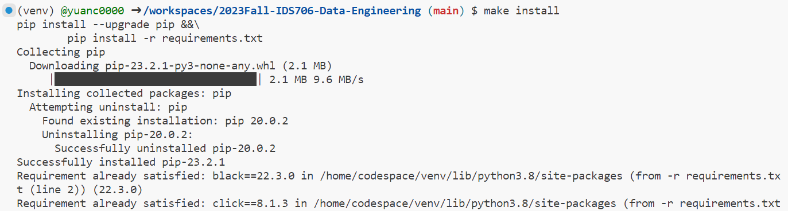
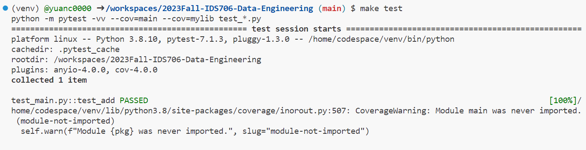
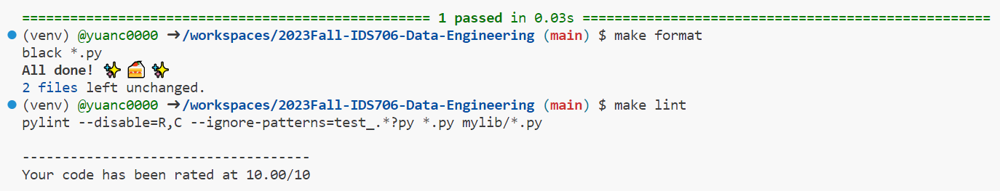

## Template for Python projects for IDS 706

This repo contains work for mini-project 1. It sets up an environment on codespaces and uses Github Actions to run a Makefile for the following: make install, make test, make format, make lint.

